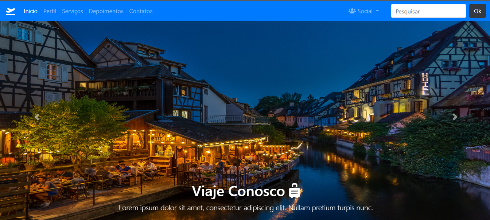

# Site de Viagens BT

<!---Esses são exemplos. Veja https://shields.io para outras pessoas ou para personalizar este conjunto de escudos. Você pode querer incluir dependências, status do projeto e informações de licença aqui--->

 Página de Viagens criada com Bootstrap. Essa página tem Navbar,carrosel,scrollspy e formulário.
 Feita no intuito de treinar Bootstrap.
 Para acessar o site clique [aqui](https://jeanaraga.github.io/Curso-de-Bootstrap/)

### Ajustes e melhorias

O projeto ainda está em desenvolvimento e as próximas atualizações serão voltadas nas seguintes tarefas:

- [x] Criar o NavBar
- [x] Criar o Carrosel de imagens
- [x] Criar o Scrollspy,Card e Modal
- [x] Criar o Jumbotron 
- [x] Criar O Formulário
- [x] Criar o Rodapé
- [ ] Terminar de Fazer a responsavidade do Carrosel

## 🤝 Colaboradores

Agradecemos às seguintes pessoas que contribuíram para este projeto:

<table>
  <tr>
    <td align="center">
    <a href="#">
         
        
          <b>Jean Pedro</b>
        
      </a>
    </td>
  </tr>
</table>
